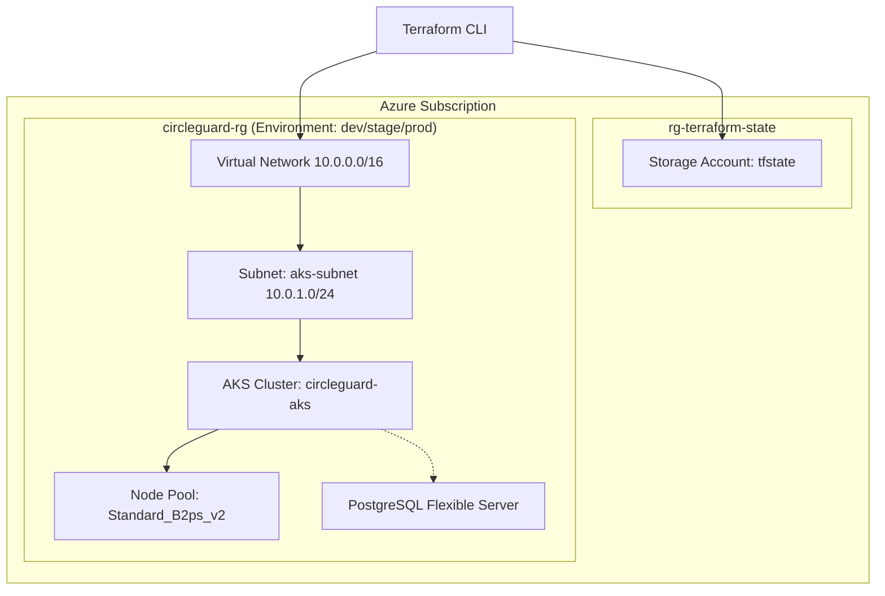

# Arquitectura de Infraestructura: CircleGuard (Azure)

Este documento describe la arquitectura de infraestructura implementada con Terraform para cumplir con el Requisito 2 del Proyecto Final.

## Diagrama de Arquitectura (Mermaid)

## Componentes
- **VNET**: Red aislada para seguridad.
- **AKS**: Orquestador de Kubernetes (Tier Free para ahorro de costos).
- **Flex Server PostgreSQL**: Base de datos administrada.
- **Remote Backend**: Estado persistente en Azure Storage con bloqueo de estado.

## Estructura de Carpetas
- `modules/`: Módulos reutilizables de infraestructura.
- `environments/`: Configuraciones específicas por ambiente (dev, stage, prod).
